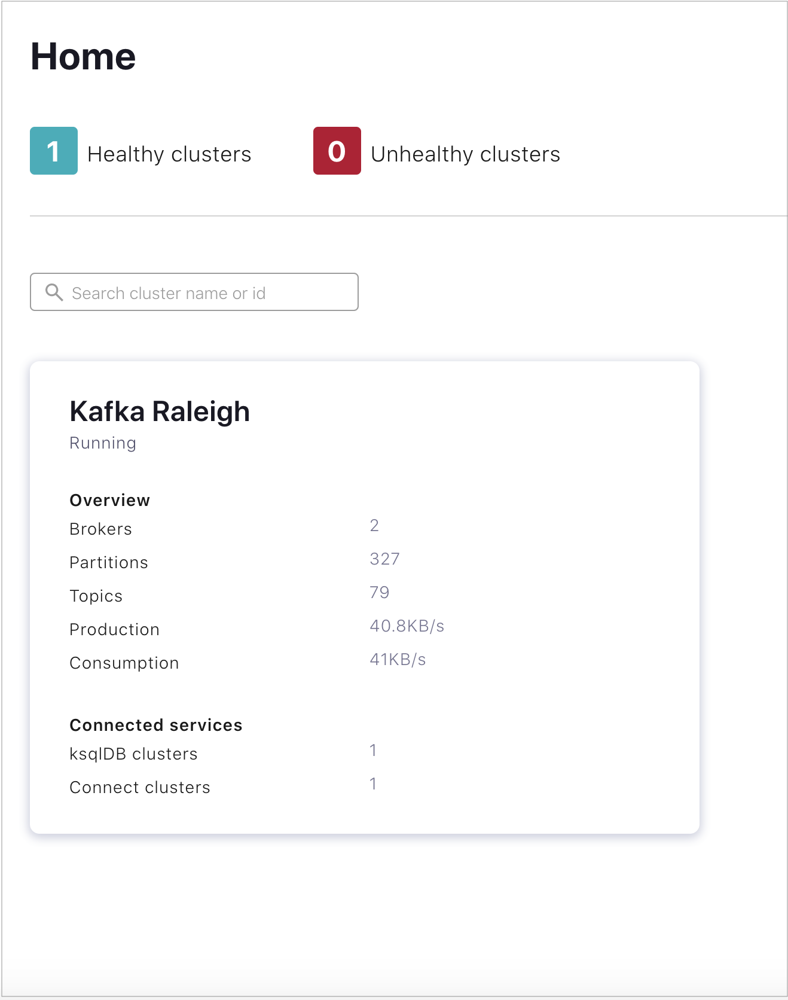

# Kafka
Data Analytics with Kafka - KAFKA#IOT


In this project a data analysis was performed on IoT data with Kafka (https://kafka.apache.org/).

The data to be monitored are provided by a Filippetti Device Simulator.

## Prerequisites

* **Ubuntu 18.04 64 bit**
* **Java 8**
* **JavaFX**
* [MQTT broker](https://github.com/eclipse/paho.mqtt-spy/wiki/Downloads)
* [Mosquitto](https://mosquitto.org/download/)
* [Simulator](https://drive.google.com/drive/folders/1wc5RS8T8z08EgPe9xKpodbjV2adJc9JG)
* [Confluent Platform](https://docs.confluent.io/5.4.2/quickstart/ce-quickstart.html#ce-quickstart)

If there are problems with JavaFX you can see a possible solution on this post https://stackoverflow.com/questions/56166267/how-do-i-get-java-fx-running-with-openjdk-8-on-ubuntu-18-04-2-lts.

## Usage
* Add mosquitto to running services
* Start mqtt data simulator
  ```bash
  java -jar simulator.jar safe_Simulator.json
  ```
  (make sure that you are in the simulator folder)

* Launch Confluent from any directory with the underneath command:
  ```bash
  confluent local services start
  ```
* Navigate to the Control Center web interface at http://localhost:9021/ and select your cluster
<br><br>

<br><br>
* Create the topics you need
* Add source connector
* Add sink connector (if you need it)
* Create and Write to a Stream and Table using KSQL

## Authors

* **Diego Diomedi** - [diegodiome](https://github.com/diegodiome)
* **Lucia Passeri** - [LuciaPasseri](https://github.com/LuciaPasseri)
